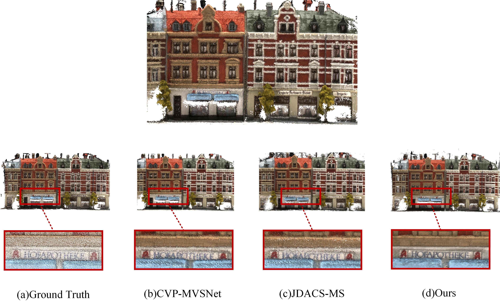

<div align="center">
  <h1 align="center">WSeg-MVSNet: Self-supervised Multi-view Stereo with Robust Weighted Segmentation</h1>
  <div align="center">
    <a href="https://github.com/Sun-Licheng/WSeg-MVSNet" target="_blank">
        
        
        
        
        
        

</div>

  <p align="center">
    <a>Licheng Sun</a><sup>1</sup>,
	<a>Liang Wang</a><sup>2</sup>
    
<br />
    <a href="https://github.com/Sun-Licheng/WSeg-MVSNet">Paper</a> | <a href="https://github.com/Sun-Licheng/WSeg-MVSNet">Project page</a>
    <br />
  </p>
</div>

## Introduction

This is the official pytorch implementation of our paper: WSeg-MVSNet: Self-supervised Multi-view Stereo with Robust Weighted Segmentation. In this paper, we propose a novel and more robust semantic MVS (Multi-View Stereo) method to address the aforementioned challenges. Our method eliminates noisy information from erroneous corresponding points between adjacent views and proposes a more adaptive and robust semantic information framework to explore semantic consistency among neighboring views, thus reducing errors caused by occlusion or non-Lambertian surfaces. Additionally, we incorporate effective data augmentation mechanisms, normalizing the predictions of augmented samples using regular samples' predictions as pseudo ground truth, ensuring algorithm robustness during complex scene reconstruction. Experimental results on the DTU dataset demonstrate that our proposed method achieves state-of-the-art performance among unsupervised methods and even surpasses some supervised methods. Finally, we show the generalizability of our method on the Tanks \& Temples dataset.



## Installation

Clone repo:
```
git clone https://github.com/Sun-Licheng/WSeg-MVSNet.git
cd WSeg-MVSNet
```

The code is tested with Python == 3.7, PyTorch == 1.8.10 and CUDA == 11.3 on NVIDIA Quadro P5000(
Here, we extend our sincere appreciation to the Multimedia Laboratory at Beijing University of Technology and the 15th Research Institute of China Electronics Corporation for providing invaluable computing resources.). We recommend you to use [anaconda](https://www.anaconda.com/) to manage dependencies. You may need to change the torch and cuda version in the `requirements.txt` according to your computer.
```
conda create -n WSeg-MVSNet python=3.7
conda activate WSeg-MVSNet
conda install pytorch==1.8.1 torchvision==0.9.1 torchaudio==0.8.1 cudatoolkit=11.3 -c pytorch -c conda-forge
pip install -r requirements.txt
```

## Datasets

### DTU

**Training**

Download the [DTU dataset](https://drive.google.com/file/d/1eDjh-_bxKKnEuz5h-HXS7EDJn59clx6V/view) pre-processed by [MVSNet](https://github.com/YoYo000/MVSNet) and extract the archive. You could use [gdown](https://github.com/wkentaro/gdown) to download it form Google Drive. You could refer to [MVSNet](https://github.com/YoYo000/MVSNet) for the detailed documents of the file formats.

Download the original resolution [depth maps](https://drive.google.com/open?id=1LVy8tsWajG3uPTCYPSxDvVXFCdIYXaS-) provided by [YaoYao](https://github.com/YoYo000/MVSNet/issues/106). Extract it and rename the folder to `Depths_raw`. 

Merge the folders together and you should get a dataset folder like below:

```
dtu
├── Cameras
├── Depths
├── Depths_raw
└── Rectified
```

**Testing**

Download the [DTU testing dataset](https://drive.google.com/file/d/135oKPefcPTsdtLRzoDAQtPpHuoIrpRI_/view) pre-processed by [MVSNet](https://github.com/YoYo000/MVSNet) and extract the archive. You could use [gdown](https://github.com/wkentaro/gdown) to download it form Google Drive. You could refer to [MVSNet](https://github.com/YoYo000/MVSNet) for the detailed documents of the file formats. 

```
dtu_test
├── scan1
├── scan4
├── scan9
...
├── scan114
└── scan118
```

## Training

Train the model on DTU dataset
```
python train.py --logdir ./wseg-mvsnet --trainpath {your data dir} --dataset dtu_train --gpu [0,1,2,3] --true_gpu 0,1,2,3 
```

## Testing

### **DTU**

You could use `eval.py` to reconstruct depthmaps and point clouds with the checkpoint. To reproduce the DTU results in our paper, run commands below:

```
python eval.py
```
After you get the point clouds, you could follow the instructions in [DTU](http://roboimagedata.compute.dtu.dk/?page_id=36) website to quantitatively evaluate the point clouds.

**DTU Point Cloud Evaluation**

We provide evaluation code in the `matlab_eval` folder. The code relies on the official code of [DTU](http://roboimagedata.compute.dtu.dk/?page_id=36) Dataset. Please use  `BaseEvalMain_web_pt.m`, `ComputeStat_web_pt.m` and `compute_mean.m` for evaluation. 

* `gt_datapath` The path to the ground truth point clouds.
* `dataPaths` The path to the generated point clouds of WSeg-MVSNet.
* `resultsPaths` The path to output metrics of the evaluation script.

<!-- LICENSE -->
## License

Our code is distributed under the BSD 3-Clause License. See `LICENSE` file for more information.

## Citation

Code and Paper Coming soon please! :)

## Contact

If you have any questions, please raise an issue or email to Licheng Sun (`leecheng_sun@126.com`or `licheng_sun@bit.edu.cn`).

## Acknowledgments

Our code follows several awesome repositories. We appreciate them for making their codes available to public.

* [MVSNet](https://github.com/YoYo000/MVSNet)
* [CVP-MVSNet](https://github.com/JiayuYANG/CVP-MVSNet)
* [MVSNet_pytorch](https://github.com/xy-guo/MVSNet_pytorch)
* [CasMVSNet](https://github.com/alibaba/cascade-stereo/tree/master/CasMVSNet)
* [PatchmatchNet](https://github.com/FangjinhuaWang/PatchmatchNet)
* [JDACS](https://github.com/ToughStoneX/Self-Supervised-MVS)
